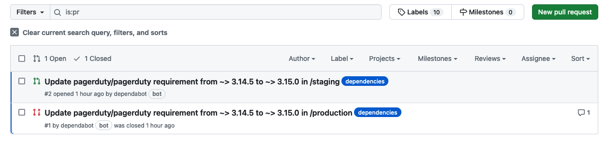
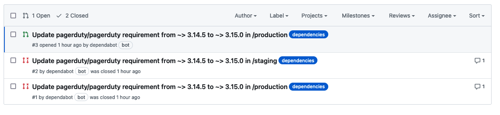

# Dependabot Testing

This repo contains two directories: `staging` and `production`. Both
of them contain the same skeleton `main.tf` file, which includes a
single module. That module is out of date, so we expect dependabot to
PR an update for us.

I **expect** to get two similar PRs, one for `staging`, and one for
`production`.

I **actually** get the PRs I expect, but then without any human
intervention, dependabot closes the production one:

If we look at [the closed pr](https://github.com/totherme/dependabot-testing/pull/1), we can see why dependabot closed it:

> Superseded by [#2](https://github.com/totherme/dependabot-testing/pull/2).

## What I think is happening

I think dependabot is doing the following:

- Loop through each directory in the repo, in alphabetical order
- Process directory `production`
  - Open a PR to upgrade `pagerduty` (in `production`)
- Process directory `staging`
  - Open a PR to upgrade `pagerduty` (in `staging`)
  - Notice that there's already a PR open to upgrade `pagerduty` (even though that one is in `staging)
    - Close that older PR as being superceded by this new one.
    
I think this is a bug. I think both PRs should remain open, even
though they're updating "the same module". I think "the same module in
a different directory" should count as "different".

## Later on...

The next time dependabot runs, it appears to flip-flop in the other
direction. It opens a PR for `production`, and on that basis closes
the open PR for `staging`:

